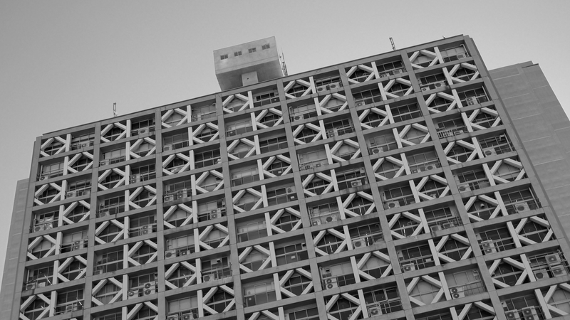

# SweepLSD

**One sweep, all segments.**

SweepLSD is a line segment detector that reads the image exactly once, top to
bottom, like a raster beam: a single streaming sweep produces all segments.
The per-pixel core is integer-only and keeps just a few rows of state —
**O(width) memory** — which makes the design FPGA-friendly and very fast on
CPUs.

*(Proposed as "OPLSD" in a 2014 master's thesis by Yoshiyasu Shimizu, Waseda
University. This repository is a from-scratch C++17 reimplementation of that
thesis plus measured improvements.)*



*The detector really works like this: one top-to-bottom sweep, a few rows of
state, and each segment is finalized the moment its last pixel passes
(labelling trails the sweep by 7 rows).*

## Headline numbers

Full-HD (1920×1080) grayscale photos, i7-8700K, AVX2, single thread. All
baselines are the **genuine author implementations** (von Gioi's LSD; Suárez
et al.'s ELSED; Akinlar & Topal's ED_Lib EDLines), built with the same ISA
target.

| | SweepLSD (one-pass) | ELSED | EDLines (ED_Lib) | LSD |
|---|---|---|---|---|
| Median time / frame | **~11 ms** | ~28 ms | ~39 ms | ~230 ms |
| Memory for intermediates | **O(width)** | O(pixels) | O(pixels) | O(pixels) |
| Segment direction error (synthetic GT) | **0.01–0.04°** | 0.07–0.11° | 0.14° | 0.14° |
| F-max, clean–low noise (σ0–5) | 0.963–0.969 | **0.979–0.986** | 0.953–0.954 | 0.92 |
| F-max, heavy noise (σ10–20) | 0.907–0.949 | **0.986** | 0.954–0.961 | 0.50–0.80 |

Honest caveats, measured and documented in `docs/`: SweepLSD's contrast-gated
edge model misses soft, low-contrast structure that LSD/EDLines recover
(orientation-coherence linking), so on coverage-hungry tasks they detect more
supporting lines. For vanishing-point estimation this is fully compensated by
the estimator choice — see `docs/vp_evaluation.html`.

## Quick start

```cpp
#include <sweeplsd/sweeplsd.hpp>
#include <sweeplsd/io.hpp>

int main() {
    sweeplsd::GrayImage img = sweeplsd::loadGray("photo.png");
    auto segments = sweeplsd::detect(img);  // the default Params{} is the shipped configuration
    // segments[i].x0 / y0 / x1 / y1  (sub-pixel endpoints)
    sweeplsd::saveSegmentVisualization("out.png", img, segments);
}
```

Build (any of GCC / Clang / MSVC, CMake ≥ 3.15):

```sh
cmake -S . -B build -DCMAKE_BUILD_TYPE=Release
cmake --build build --parallel
ctest --test-dir build            # parity tests: one-pass == multi-pass
./build/sweeplsd_cli photo.png out.png
```

Use as a CMake package: `find_package(sweeplsd CONFIG REQUIRED)` then link
`sweeplsd::sweeplsd` (core, zero dependencies), `sweeplsd::io` (PNG/JPG via
vendored stb), or `sweeplsd::opencv` (header-only `cv::Mat` adapter, a drop-in
for OpenCV's LSD).

**Compiler performance note.** The kernels contain no SIMD intrinsics by
design (FPGA-oriented, readable); the speed comes from compiler
auto-vectorization. GCC and Clang vectorize them fully (~11 ms one-pass,
~16 ms multi-pass at Full-HD). MSVC compiles and passes all tests but currently
does not vectorize the byte kernels (~39 ms — about 3.4× slower); on Windows
prefer MinGW-w64 or clang-cl
for performance-critical use.

## How it works

Five stages, all expressed as row streams over the raster sweep:

1. **Gaussian** 5×5 separable blur (integer, single `>>10` rescale)
2. **Gradient** 2×2 operator; power `(|dx|+|dy|+1)/2`, direction quantised H/V
3. **Edge** threshold + non-maximum suppression along the gradient
4. **Endpoint candidates** 5×5 ring logic marking where segments start/end/branch
5. **Labelling + judgment** streaming connected components carrying scatter
   moments; a component becomes a segment iff it has enough pixels and its
   PCA eigenvalue ratio says "thin and straight"

Two drivers share the same kernels and are tested to produce identical output:
`detect()` (one full-image pass per stage — easiest to read) and
`detectOnePass()` (the streaming single-sweep driver — O(width) memory, and
the fastest configuration). `Params{}` is SweepLSD as published: the measured
refinements (sub-pixel NMS, streaming hysteresis, curve rejection, half-pixel
lattice correction, …) are all enabled, each individually documented,
benchmarked, and disableable; `Params::original2014()` restores the 2014
thesis implementation's pipeline (the judgment thresholds keep the library
defaults). (`Params::improved()` remains as an alias
of the default for code written against earlier releases.)

The full explanation with per-stage figures is in [the docs](https://ysmz334.github.io/sweeplsd/).

## On real hardware (FPGA)

The thesis proposed OPLSD as a frame-buffer-free, one-pass method aimed at
hardware, but implemented it only in software; the FPGA form was left as future
work. This repository closes that gap.

SweepLSD has been reimplemented as **synthesizable HLS C++** and as **portable
Verilog RTL**, and runs **live on a Digilent Atlys** (Xilinx Spartan-6 LX45 —
2009 silicon): **HDMI in → detect → green segment overlay → HDMI out**, at
Full-HD **1080p30** (and 720p60), with **no frame buffer and no external
memory** — the detector's entire state is a few line buffers in on-chip block
RAM (~70 KiB, the budget the thesis targeted).

The hardware is held to the same standard as the software: the RTL is
**bit-exact** against the C++ `detect()` reference and the HLS C model —
identical segments over the full test corpus, including 1920×1080 photos
(SW == HLS == RTL is the standing acceptance gate). The `improved()` refinements
that fit the streaming/integer model — strict NMS, half-pixel lattice,
bounding-box endpoints, streaming hysteresis, curve rejection, border
rejection — are all in the hardware too.

https://github.com/user-attachments/assets/b0a95a7a-fac0-4c62-ac6a-86731b2cbbeb

*SweepLSD running live on a Digilent Atlys (Spartan-6 LX45): 1080p30 HDMI video passes through the board while every frame's line segments are detected on-chip and overlaid in green.*

Board build & the one third-party dependency (Xilinx XAPP495 HDMI PHY, fetched
separately) → [`rtl/boards/atlys/README.md`](rtl/boards/atlys/README.md);
architecture & verification → [`rtl/DESIGN.md`](rtl/DESIGN.md).

## Examples

- `examples/manhattan_frame.cpp` — **calibrated Manhattan-frame / vanishing
  directions** with the estimator configuration that measured best for
  SweepLSD on York Urban + NYU (each line votes once, vertical-prior seed,
  strong candidate search): `sweeplsd_manhattan photo.jpg --focal 675`
- `examples/vanishing_points.cpp` — uncalibrated sequential-RANSAC vanishing
  points in image space (no intrinsics needed)
- `examples/opencv_detect.cpp` — using SweepLSD from OpenCV code via the
  header-only adapter

## Evaluation

Everything in `docs/` is reproducible: synthetic ground-truth generation,
speed benchmarks, isotropy tests, and downstream vanishing-point evaluation
(York Urban outdoor, NYU indoor) against genuine LSD and ED_Lib EDLines.
Third-party detector code is **not vendored** (LSD is AGPL); the benchmark
harness fetches it at configure time with `-DSWEEPLSD_BUILD_BENCH=ON`.

## About this project

SweepLSD was designed by Yoshiyasu Shimizu (2014 master's thesis, presented
at a domestic workshop as OPLSD; the thesis itself is not distributed here).
This reimplementation, the improvements, and the evaluation suite were built
by the author in collaboration with Claude (Anthropic) — the code, benchmarks,
and documentation were produced in AI-assisted pair-work sessions, with all
algorithmic claims verified by the measurements in `docs/`.

## License

MIT — see [LICENSE](LICENSE). Vendored `stb_image` / `stb_image_write`
(public-domain/MIT) live in `third_party/stb/`.
